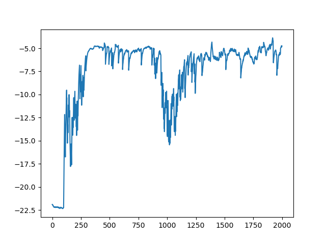

# TD3-smart-car

在gazebo仿真平台下，基于TD3强化学习算法实现的turtlebot3机器人自主导航避障。

本科阶段做的小项目。导航通过导引向量场方法实现。

其中.pth结尾的文件即权重文件，runs中存放了训练过程数据，可以通过tensorboard可视化。

训练2000轮的结果如下：

算法部署到小车实物中的演示效果：

<video src="./video.MP4"></video>

